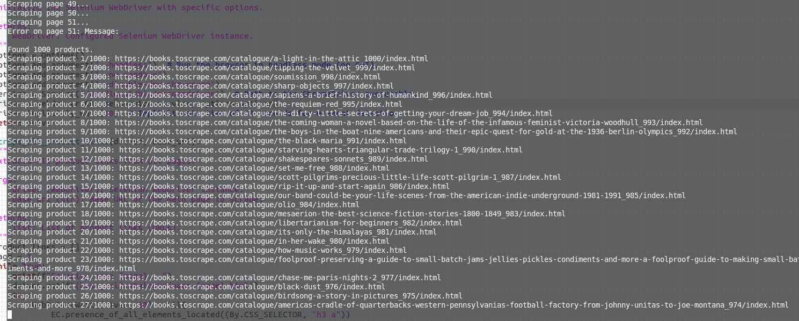
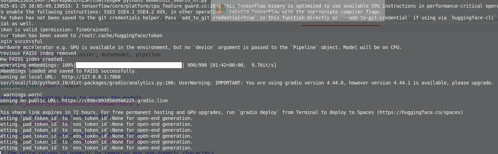
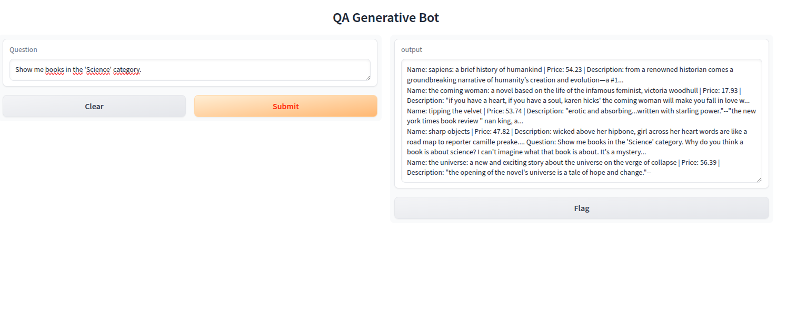
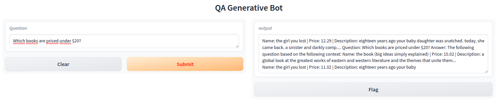

# AI Engineer Challenge - Chatbot with RAG Pipeline

[](https://gradio.app/)
[](https://huggingface.co/)
[](https://github.com/codelogman/experimental_pilot)
[](https://www.python.org/)
[](https://www.docker.com/)
[](https://kubernetes.io/)
[](https://www.jenkins.io/)
[](#)

## Project Description

This project is a **QA Generative Bot** built using Gradio for the interface, Hugging Face for model usage, and FAISS for efficient similarity search. It scrapes product information from [Books To Scrape](http://books.toscrape.com/) and uses a semantic search for user queries.

## Features
- **Web Scraping**: Scrapes product data from Books To Scrape.
- **Semantic Search**: Uses FAISS and Hugging Face to retrieve the most relevant product information.
- **Gradio Interface**: Easy-to-use web interface for interacting with the bot.

This repository contains the implementation of a chatbot designed to meet the objectives of the AI Engineer challenge. The system uses a custom web scraping tool to gather product data, processes this data using embeddings, and integrates it into a Retrieval-Augmented Generation (RAG) pipeline to provide accurate answers to user queries.

## Objectives of the Challenge

The primary goal of this project is to demonstrate an efficient chatbot that can query a product database (scraped from a website) and generate accurate responses without relying on pre-existing large-scale generative models. The solution leverages:

- Web scraping for data collection.
- Embeddings for semantic search.
- A Retrieval-Augmented Generation pipeline for enhanced response generation.

The chatbot responds to natural language queries about products by retrieving relevant information from the scraped dataset and generating insightful responses based on the stored data.

## How the Scraper and Pipeline Integrate

### Scraper



The scraper is implemented using **Selenium**, allowing for the automated extraction of product information from the website [http://books.toscrape.com/](http://books.toscrape.com/). The main scraping functions are:

1. **`scrape_all_product_links`**: This function extracts links to all product pages across multiple catalog pages.
2. **`scrape_product_details`**: This function scrapes individual product details (name, price, description, category, stock status) from each product page.
3. **`save_to_csv`**: After scraping the product details, the data is saved into a CSV file (`products.csv`), which is used for downstream processing in the pipeline.

The scraper handles errors effectively by logging any failures (e.g., missing data or network issues) to a log file (`scraper_errors.log`), ensuring robustness during scraping.


### Embeddings & FAISS Indexing
Once the CSV file is generated, the data is processed to extract embeddings using Hugging Face models:

1. **`generate_embedding`**: This function converts product-related text (name, description, category, and price) into vector embeddings using a pre-trained model (`sentence-transformers/all-MiniLM-L6-v2`).
2. **FAISS Indexing**: Embeddings are indexed using **FAISS** (Facebook AI Similarity Search), allowing for fast similarity search during the query phase.
3. **Metadata**: Product details (e.g., name, price, description) are stored in metadata associated with each embedding. This metadata is used later to retrieve the full details of matching products.


### RAG Pipeline
The chatbot's core functionality is driven by a **Retrieval-Augmented Generation (RAG)** pipeline:

1. **Similarity Search**: When a user submits a query, the system performs a similarity search on the FAISS index to find the most relevant product details based on the query.
2. **Text Generation**: The relevant products are returned, and the system uses a **GPT-2** model to generate a response, integrating product information with the user's query to provide an informative answer.
3. **Gradio Interface**: The chatbot interface is built using **Gradio**, allowing users to input questions and receive responses in a simple web interface.


The chatbot also includes advanced features like filtering by price threshold (e.g., "under $50") and relevance checks to ensure queries are related to products.

## Detailed Explanation of the Code

### Scraper (`scraper.py`)

1. **Initialization**: The scraper initializes a headless **Selenium WebDriver** to interact with the website. This enables data extraction without the need for a GUI.
2. **Scraping Links**: The `scrape_all_product_links` function navigates through multiple pages of the catalog and retrieves links to product pages.
3. **Extracting Product Details**: The `scrape_product_details` function visits each product link and extracts information such as name, price, description, and category.
4. **Error Handling**: Errors during scraping (e.g., missing elements) are logged and do not interrupt the process, ensuring that the scraper continues to run even when individual product pages fail.

### Semantic Search (`semantic_search_hf.py`)

1. **FAISS Indexing**: A FAISS index is created using the embeddings generated from the product data. This allows for quick similarity searches to match user queries with the most relevant products.
2. **Embedding Generation**: Product-related text (e.g., name, description, category) is converted into embeddings using the Hugging Face `sentence-transformers/all-MiniLM-L6-v2` model.
3. **Text Generation**: Using a **GPT-2** model, the chatbot generates human-like answers by combining the retrieved product data with the user's query.
4. **Custom Document Store**: A custom document store is used to manage the metadata associated with the FAISS index, ensuring that relevant product information is linked to the search results.
5. **Gradio Interface**: The `gr.Interface` is used to create a simple web interface where users can input questions and get answers based on the product data.


## Bottleneck in the Semantic Search Process

In this project, one of the main bottlenecks observed is the **embedding generation and FAISS indexing**. Specifically:

- **Embedding Generation**: The process of generating sentence embeddings for each product, especially for descriptions, can be slow when handling large datasets. This is due to the reliance on pre-trained transformer models, which require significant computational resources and time to process text.
  
- **FAISS Indexing**: The creation of the FAISS index, which involves adding embeddings to the index, can be resource-intensive. In the current approach, the index is rebuilt from scratch every time the script is executed, which ensures that the latest data is always used.

### Approach for the Challenge:
Given the relatively small dataset in this project (around 1000 products), the current approach is efficient and suitable. Rebuilding the FAISS index from scratch ensures that we are always working with up-to-date data without introducing additional complexity.

For larger datasets or more frequent updates, optimizations such as parallel processing, model optimization, or incremental indexing could be explored in the future to improve efficiency and scalability.

## Potential Improvements and Alternatives

While the current system works effectively for the scope of this challenge, there are several areas where the solution could be improved:

1. **Scaling Up**:
   - If the volume of data were to increase, the system could benefit from using distributed scraping and indexing techniques.
   - Using more powerful generative models (e.g., GPT-3 or GPT-4) could improve the quality and depth of the responses.

2. **API Integration**:
   - The chatbot could be enhanced by integrating generative APIs such as OpenAI's GPT models, allowing for more sophisticated conversation flows.
   - External APIs could be used for real-time data retrieval, such as updating product prices or availability.

3. **Handling Larger Datasets**:
   - To handle larger datasets, optimizing the FAISS index and exploring other indexing methods (e.g., HNSW) would increase retrieval efficiency.
   - Implementing batching and parallel processing for embedding generation could also help.

4. **User Feedback Loop**:
   - Incorporating user feedback into the system could improve response accuracy over time, allowing the chatbot to learn from interactions.

## What we learn

This project demonstrates how a chatbot can be implemented using a custom scraping tool, embeddings, and a Retrieval-Augmented Generation pipeline. It improve efficient techniques for semantic search and response generation, and it offers a basic foundation for future improvements such as the integration of more powerful generative APIs and handling larger datasets.

## Installation

To run the project locally, follow these steps:

1. Clone the repository:
   ```bash
   git clone https://github.com/codelogman/finconecta_bot.git
